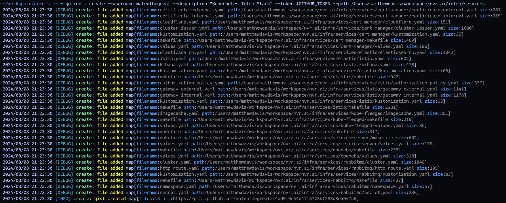

# GitHub Gist Manager CLI

CLI tool to create and manage GitHub gists.



- 🚀Create a gist from a directory recursively.
- 🔍 Search for a gist by description, filename, or file content.
- 📝 Edit a gist locally in your editor of choice.
- 🗑️ Bulk delete gists based on description, filename, or file content.

Example gist created from 18 files in the `services` directory of the [nvr.ai](https://nvr.ai) repository is at <https://gist.github.com/mateothegreat/f4a09f9e44d4f15723bf283d8e4947c6>

## Installation

```bash
go install github.com/mateothegreat/gister
```

## Usage

Your GitHub token is required to create a gist. You can create a token [here](https://github.com/settings/tokens) and set it as the `GITHUB_TOKEN` environment variable or pass it as the `--token` flag.

```bash
gister create --username mateothegreat \
              --description "Kubernetes Infra Stack" \
              --token $GITHUB_TOKEN \
              --path /Users/matthewdavis/workspace/nvr.ai/infra/services
```

## Commands

| Command | Description       |
| ------- | ----------------- |
| create  | Create a new gist |
| list    | List all gists    |
| delete  | Delete a gist     |
| update  | Update a gist     |
